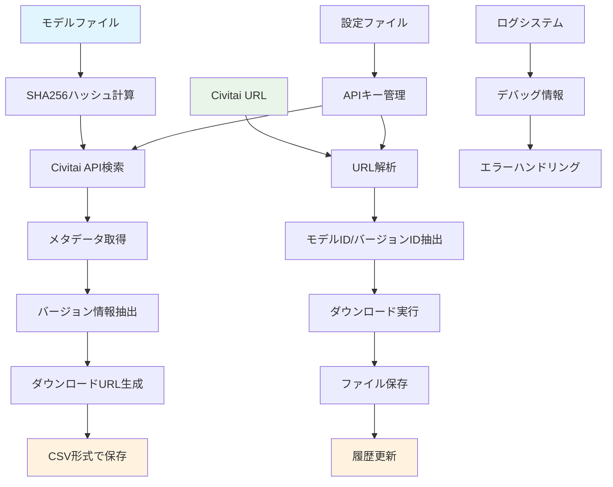

# Civitai Model Downloader

Civitai.comからモデルをダウンロードするスタンドアロンPythonスクリプト

## 機能概要

### 主要機能

1. **モデルからメタデータを取得**
   - SHA256ハッシュベースのモデル検索
   - Civitai APIからメタデータ取得
   - バージョン情報とダウンロードURL抽出

2. **モデルURLからモデルを取得**
   - Civitai URLからの直接ダウンロード
   - レジューム機能対応
   - 進捗表示とエラーハンドリング

### 機能関係図



## 特徴

- ✨ Civitai APIキーを使用した認証ダウンロード
- 📥 レジューム機能対応（途中で中断しても続きから再開可能）
- 📊 リアルタイム進捗表示（%, サイズ, 速度）
- 📝 CSV形式のダウンロード履歴管理
- 🎯 モデルタイプ別のフォルダ管理（LoRA, Checkpoint, Embedding）
- 🔄 重複ダウンロードの検出と警告
- 📋 履歴表示と再ダウンロード機能
- 🔄 バッチダウンロード対応（Notebook版）
- 🚀 非同期処理による高速ダウンロード
- 🔍 SHA256ハッシュベースのメタデータ抽出
- 🏷️ ディレクトリ構造によるモデルタイプ自動判定
- 🔗 バージョン特定URL生成（modelId?modelVersionId形式）

## インストール

### 1. 依存ライブラリのインストール

```bash
pip install -r requirements.txt
```

### 2. 設定ファイルの作成

`config.json.example`を`config.json`にコピーして編集：

```bash
cp config.json.example config.json
```

`config.json`を編集してAPIキーとダウンロードパスを設定：

```json
{
  "civitai_api_key": "your_actual_api_key_here",
  "download_paths": {
    "lora": "./downloads/loras",
    "checkpoint": "./downloads/checkpoints",
    "embedding": "./downloads/embeddings"
  },
  "download_history_file": "./download_history.csv"
}
```

### 3. Civitai APIキーの取得

1. [Civitai.com](https://civitai.com)にログイン
2. プロフィールアイコン → **Account Settings**
3. **API Keys** → **Add API Key**
4. 生成されたAPIキーをコピーして`config.json`に貼り付け

## 使用方法

### 基本的な使い方

```bash
python downloader.py -u "URL" -t "TYPE"
```

**パラメータ:**
- `-u, --url`: Civitai モデルURL（必須）
- `-t, --type`: モデルタイプ `lora`, `checkpoint`, `embedding`（必須）
- `-c, --config`: 設定ファイルのパス（オプション、デフォルト: `config.json`）
- `--list-history`: ダウンロード履歴を表示
- `--redownload INDEX`: 履歴から指定インデックスのアイテムを再ダウンロード
- `--redownload-url URL`: 指定URLを再ダウンロード
- `--force`: 既存ファイルの上書きを強制

### 対応URL形式

以下の3つの形式のURLに対応：

1. `https://civitai.com/models/649516`
2. `https://civitai.com/models/649516?modelVersionId=726676`
3. `https://civitai.com/models/649516/model-name?modelVersionId=726676`

### 使用例

#### LoRAモデルをダウンロード
```bash
python downloader.py -u "https://civitai.com/models/649516?modelVersionId=726676" -t lora
```

#### Checkpointモデルをダウンロード
```bash
  python downloader.py -u "https://civitai.com/models/123456" -t checkpoint
```

#### Embeddingモデルをダウンロード
```bash
python downloader.py -u "https://civitai.com/models/789012" -t embedding
```

#### カスタム設定ファイルを使用
```bash
python downloader.py -u "https://civitai.com/models/649516" -t lora -c my_config.json
```

#### ダウンロード履歴を表示
```bash
python downloader.py --list-history
```

#### 履歴から再ダウンロード
```bash
# インデックス指定で再ダウンロード
python downloader.py --redownload 1

# URL指定で再ダウンロード
python downloader.py --redownload-url "https://civitai.com/models/649516"
```

## ダウンロード履歴

ダウンロードに成功すると、自動的に`download_history.csv`（設定で変更可能）に記録されます：

```csv
timestamp,model_type,url,filename,model_id,version_id,file_size
2025-01-15 14:30:22,lora,https://civitai.com/models/649516?modelVersionId=726676,model.safetensors,649516,726676,143.25 MB
```

履歴は以下のコマンドで確認・操作できます：
- `--list-history`: 履歴一覧を表示
- `--redownload INDEX`: 指定インデックスのアイテムを再ダウンロード
- `--redownload-url URL`: 指定URLを再ダウンロード

## トラブルシューティング

### エラー: 設定ファイルが見つかりません
- `config.json.example`を`config.json`にコピーして編集してください

### エラー: Civitai APIキーが設定されていません
- `config.json`の`civitai_api_key`に有効なAPIキーを設定してください

### エラー: 認証エラー
- APIキーが正しいか確認してください
- Civitai.comでAPIキーが無効化されていないか確認してください

### エラー: アクセス拒否（403）
- Early Accessモデルの可能性があります
- Civitai.comで購入が必要なモデルかどうか確認してください

### ダウンロードが途中で止まった
- そのまま同じコマンドを再実行すれば、続きから再開されます
- `.part`ファイルが自動的に作成され、レジューム機能が働きます

## ファイル構成

```
civitai_downloader/
├── config.json.example      # 設定ファイルのテンプレート
├── config.json              # 実際の設定ファイル（手動作成）
├── downloader.py            # メインスクリプト
├── url_parser.py            # URL解析モジュール
├── config_manager.py        # 設定管理モジュール
├── download_history.py      # 履歴管理モジュール
├── requirements.txt         # 依存ライブラリ
├── README.md                # このファイル
├── downloads/               # ダウンロード先（自動作成）
│   ├── loras/
│   ├── checkpoints/
│   └── embeddings/
└── download_history.csv     # ダウンロード履歴（自動作成）
```

## ライセンス

このスクリプトはComfyUI-Lora-Managerの実装を参考に開発されました。

## 現状の実装状況

### 実装済み機能

#### 1. メタデータ抽出システム
- ✅ **SHA256ハッシュ計算**: モデルファイルのハッシュを計算
- ✅ **Civitai API連携**: 認証付きAPI呼び出しとレート制限対応
- ✅ **メタデータ抽出**: モデル名、作成者、タグ、NSFWレベル等の詳細情報取得
- ✅ **ダウンロードURL抽出**: プライマリURLとミラーURLの取得
- ✅ **CSV形式出力**: 既存のdownload_history.csv形式に完全対応
- ✅ **ディレクトリ構造判定**: ファイルパスからモデルタイプを自動判定
- ✅ **バージョン特定URL**: `https://civitai.com/models/{modelId}?modelVersionId={versionId}`形式

#### 2. ダウンロードシステム
- ✅ **URL解析**: Civitai URLからモデルID/バージョンID抽出
- ✅ **レジューム機能**: 中断したダウンロードの再開
- ✅ **進捗表示**: リアルタイム進捗と速度表示
- ✅ **エラーハンドリング**: 堅牢なエラー処理とリトライ機能
- ✅ **履歴管理**: CSV形式でのダウンロード履歴保存

#### 3. 設定・ログシステム
- ✅ **設定管理**: JSON形式の設定ファイル
- ✅ **ログ機能**: 詳細なデバッグログとエラーログ
- ✅ **APIキー管理**: 環境変数での安全な管理

### 対応モデルタイプ

| タイプ | ディレクトリ | 判定方法 | 対応状況 |
|--------|-------------|----------|----------|
| LoRA | `/loras/` | ディレクトリ構造 | ✅ 完全対応 |
| Checkpoint | `/checkpoints/` | ディレクトリ構造 | ✅ 完全対応 |
| Embedding | `/embeddings/` | ディレクトリ構造 | ✅ 完全対応 |

### 出力形式

#### CSV形式（download_history.csv）
```csv
timestamp,model_type,url,filename,model_id,version_id,file_size,file_size_bytes
2025-10-19 04:11:04,checkpoint,https://civitai.com/models/827184?modelVersionId=2167369,waiIllustriousSDXL_v150.safetensors,827184,2167369,6.46 GB,6938040682
```

#### 詳細メタデータ（JSON形式）
```json
{
  "file_name": "waiIllustriousSDXL_v150.safetensors",
  "model_id": 827184,
  "version_id": 2167369,
  "model_name": "v15.0",
  "creator": "WAI0731",
  "civitai_url": "https://civitai.com/models/827184?modelVersionId=2167369",
  "download_urls": ["https://civitai.com/api/download/models/2167369"],
  "tags": ["anime", "base model"],
  "nsfw_level": 0
}
```

### テスト済み機能

- ✅ **単一ファイルメタデータ抽出**: 実際のモデルファイルでテスト済み
- ✅ **バッチ処理**: 複数ファイルの一括処理
- ✅ **CSV出力**: 既存形式との互換性確認済み
- ✅ **URL生成**: バージョン特定URLの正確性確認済み
- ✅ **エラーハンドリング**: 各種エラーケースの対応確認済み

## 注意事項

- ダウンロードするモデルのライセンスを必ず確認してください
- 大容量ファイルのダウンロードには時間がかかります
- ネットワーク接続が安定している環境で使用してください
- Civitai APIのレート制限（1分間に60リクエスト）に注意してください

