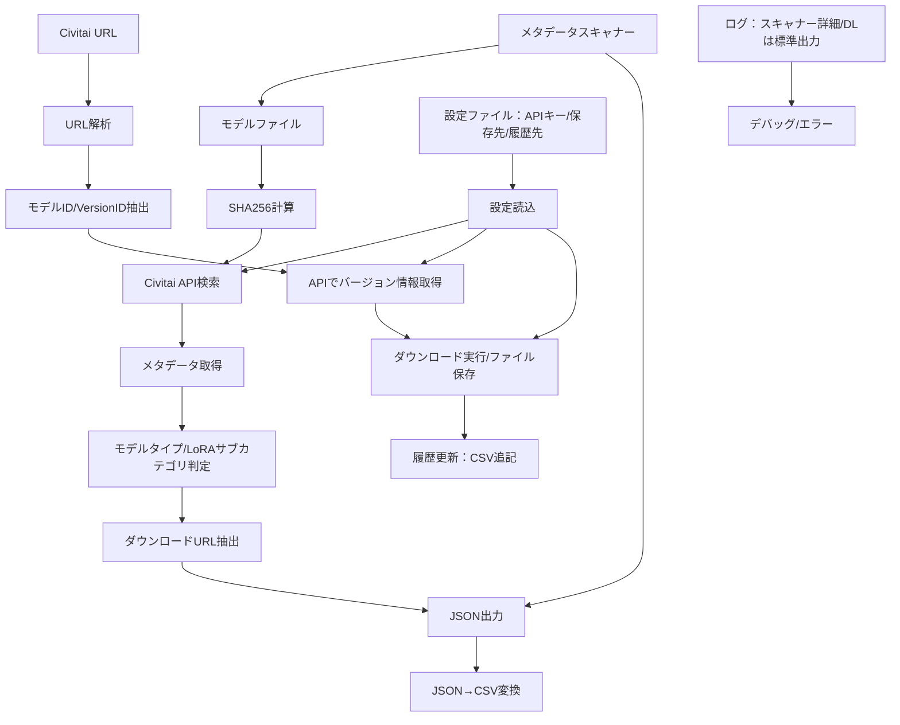

# Civitai Model Downloader

Civitai.comからモデルをダウンロードするスタンドアロンPythonスクリプト

## 機能概要

### 主要機能

1. **モデルからメタデータを取得**
   - SHA256ハッシュベースのモデル検索
   - Civitai APIからメタデータ取得
   - バージョン情報とダウンロードURL抽出

2. **モデルURLからモデルを取得**
   - Civitai URLからの直接ダウンロード
   - レジューム機能対応
   - 進捗表示とエラーハンドリング

3. **メタデータスキャナー**
   - 既存のモデルファイルからメタデータを逆引き
   - SHA256ハッシュベースの検索
   - バッチ処理による一括メタデータ抽出

### 機能関係図



## 特徴

- ✨ Civitai APIキーを使用した認証ダウンロード
- 📥 レジューム機能対応（途中で中断しても続きから再開可能）
- 📊 リアルタイム進捗表示（%, サイズ, 速度）
- 📝 CSV形式のダウンロード履歴管理
- 🎯 モデルタイプ別のフォルダ管理（LoRA, Checkpoint, Embedding）
- 🔄 重複ダウンロードの検出と警告
- 📋 履歴表示と再ダウンロード機能
- 🔄 バッチダウンロード対応（Notebook版）
- 🚀 非同期処理による高速ダウンロード
- 🔍 SHA256ハッシュベースのメタデータ抽出
- 🤖 API ベースの正確なモデルタイプ判定（LORA, LoCon, Checkpoint, TextualInversion）
- 🏷️ LoRA サブカテゴリ自動分類（style, character, concept, clothing, background, objects, poses）
- 🏷️ ディレクトリ構造 + API データによるモデルタイプ自動判定
- 🔗 バージョン特定URL生成
- 🔍 プロトタイプスキャナーによる既存ファイルのメタデータ逆引き
- 📝 タイムスタンプ付き実行ログ自動保存（logs/ディレクトリ）
- 📊 JSON→CSV変換ツール（重複チェック・自動追記）

## インストール

### 1. 依存ライブラリのインストール

```bash
pip install -r requirements.txt
```

### 2. 設定ファイルの作成

`config.json.example`を`config.json`にコピーして編集：

```bash
cp config.json.example config.json
```

`config.json`を編集してAPIキーとダウンロードパスを設定：

```json
{
  "civitai_api_key": "your_civitai_api_key_here",
  "download_paths": {
    "lora": "./downloads/loras",
    "checkpoint": "./downloads/checkpoints",
    "embedding": "./downloads/embeddings"
  },
  "download_history_file": "./download_history.csv"
}
```

### 3. Civitai APIキーの取得

1. [Civitai.com](https://civitai.com)にログイン
2. プロフィールアイコン → **Account Settings**
3. **API Keys** → **Add API Key**
4. 生成されたAPIキーをコピーして`config.json`に貼り付け

## 使用方法

### メタデータスキャナーの実行

#### 1. 設定ファイルの準備
```bash
# config.jsonを編集
{
  "civitai_api_key": "your_civitai_api_key_here",
  "download_paths": {
    "lora": "./downloads/loras",
    "checkpoint": "./downloads/checkpoints", 
    "embedding": "./downloads/embeddings"
  }
}
```

#### 2. スキャナーの実行
```bash
# 単一ファイルのメタデータ抽出
python model_metadata_scanner.py

# 全ディレクトリの一括スキャン
python regenerate_metadata.py
```

#### 3. 出力ファイル
- 共通: `model_metadata_results.json`（詳細メタデータ, JSON）
- model_metadata_scanner.py を直接実行: `download_history.csv` に重複チェック付きで自動追記（内部で `json_to_csv.py` を呼び出し）
- regenerate_metadata.py を実行: `download_history_updated.csv` を新規生成（既存履歴は変更しない）
- ログ: `logs/model_metadata_scanner_YYYY-MM-DD_HH-MM-SS.log`

### JSON→CSV変換

スキャナーが生成したJSONファイルをCSV形式に変換：

```bash
# 既存の履歴(download_history.csv)へ追記（重複スキップ）
python json_to_csv.py -i model_metadata_results.json

# カスタム出力先を指定
python json_to_csv.py -i model_metadata_results.json -o custom_history.csv
```

- 備考:
  - model_metadata_scanner.py を直接実行した場合は自動で `download_history.csv` に追記されます。
  - regenerate_metadata.py は `download_history_updated.csv` を生成します。既存履歴にマージする場合は上記の `json_to_csv.py` を使って `-o download_history.csv` を指定してください。

**機能:**
- 重複チェック（model_id + version_idベース）
- 既存CSVへの自動追記
- スキップされた重複の通知

### 基本的な使い方

```bash
python downloader.py -u "URL" -t "TYPE"
```

**パラメータ:**
- `-u, --url`: Civitai モデルURL（必須）
- `-t, --type`: モデルタイプ `lora`, `checkpoint`, `embedding`（オプション、指定しない場合は自動判定）
- `-c, --config`: 設定ファイルのパス（オプション、デフォルト: `config.json`）
- `--list-history`: ダウンロード履歴を表示
- `--redownload INDEX`: 履歴から指定インデックスのアイテムを再ダウンロード
- `--redownload-url URL`: 指定URLを再ダウンロード
- `--force`: 既存ファイルの上書きを強制

### 対応URL形式

以下の2つの形式のURLに対応：

1. `https://civitai.com/models/649516`
2. `https://civitai.com/models/649516?modelVersionId=726676`

### 使用例

#### モデルタイプを自動判定
```bash
python downloader.py -u "https://civitai.com/models/649516?modelVersionId=726676"
```

#### LoRAモデルをダウンロード（手動指定）
```bash
python downloader.py -u "https://civitai.com/models/649516?modelVersionId=726676" -t lora
```

#### Checkpointモデルをダウンロード
```bash
  python downloader.py -u "https://civitai.com/models/123456" -t checkpoint
```

#### Embeddingモデルをダウンロード
```bash
python downloader.py -u "https://civitai.com/models/789012" -t embedding
```

#### カスタム設定ファイルを使用
```bash
python downloader.py -u "https://civitai.com/models/649516" -t lora -c my_config.json
```

#### ダウンロード履歴を表示
```bash
python downloader.py --list-history
```

#### 履歴から再ダウンロード
```bash
# インデックス指定で再ダウンロード
python downloader.py --redownload 1

# URL指定で再ダウンロード
python downloader.py --redownload-url "https://civitai.com/models/649516"

# 全件再ダウンロード（引数なし）
python downloader.py --redownload-url

# インデックスを --redownload-url に指定（ショートカット）
python downloader.py --redownload-url 3
```

## ダウンロード履歴

ダウンロードに成功すると、自動的に`download_history.csv`（設定で変更可能）に記録されます（10列フォーマット）：

```csv
timestamp,model_type,api_model_type,lora_subcategory,url,filename,model_id,version_id,file_size,file_size_bytes
2025-01-15 14:30:22,lora,LORA,character,https://civitai.com/models/649516?modelVersionId=726676,model.safetensors,649516,726676,143.25 MB,150220800
```

履歴は以下のコマンドで確認・操作できます：
- `--list-history`: 履歴一覧を表示
- `--redownload INDEX`: 指定インデックスのアイテムを再ダウンロード
- `--redownload-url URL`: 指定URLを再ダウンロード

## トラブルシューティング

### エラー: zsh: no matches found (URLエラー)
- **原因**: zshが`?`や`&`をグロブパターンとして解釈
- **解決方法**: URLを引用符で囲んでください
```bash
# ❌ エラー
python downloader.py -u https://civitai.com/models/123?modelVersionId=456

# ✅ 正しい使い方
python downloader.py -u "https://civitai.com/models/123?modelVersionId=456"
```

### エラー: 設定ファイルが見つかりません
- `config.json.example`を`config.json`にコピーして編集してください

### エラー: Civitai APIキーが設定されていません
- `config.json`の`civitai_api_key`に有効なAPIキーを設定してください

### エラー: 認証エラー
- APIキーが正しいか確認してください
- Civitai.comでAPIキーが無効化されていないか確認してください

### エラー: アクセス拒否（403）
- Early Accessモデルの可能性があります
- Civitai.comで購入が必要なモデルかどうか確認してください

### ダウンロードが途中で止まった
- そのまま同じコマンドを再実行すれば、続きから再開されます
- `.part`ファイルが自動的に作成され、レジューム機能が働きます

## ファイル構成

```
civitai_downloader/
├── config.json.example      # 設定ファイルのテンプレート
├── config.json              # 実際の設定ファイル（手動作成）
├── downloader.py            # メインスクリプト
├── model_metadata_scanner.py # メタデータスキャナー
├── json_to_csv.py           # JSON→CSV変換ツール
├── regenerate_metadata.py   # 一括メタデータ再生成
├── url_parser.py            # URL解析モジュール
├── config_manager.py        # 設定管理モジュール
├── download_history.py      # 履歴管理モジュール
├── requirements.txt         # 依存ライブラリ
├── README.md                # このファイル
├── downloads/               # ダウンロード先（自動作成）
│   ├── loras/
│   ├── checkpoints/
│   └── embeddings/
├── logs/                    # 実行ログ（自動作成）
├── bak/                     # 旧コード保管
└── download_history.csv     # ダウンロード履歴（自動作成）
```

## ライセンス

- 本プロジェクトは MIT License の下で配布されています。`LICENSE` ファイルを参照してください。
- ComfyUI-Lora-Manager (GPL-3.0) の設計アイデアを参考にしつつ、コードは独自に実装しています。

## 現状の実装状況

### 実装済み機能

#### 1. メタデータ抽出システム
- ✅ **SHA256ハッシュ計算**: モデルファイルのハッシュを計算
- ✅ **Civitai API連携**: 認証付きAPI呼び出しとレート制限対応
- ✅ **メタデータ抽出**: モデル名、作成者、タグ、NSFWレベル等の詳細情報取得
- ✅ **ダウンロードURL抽出**: プライマリURLとミラーURLの取得
- ✅ **CSV形式出力**: 既存のdownload_history.csv形式に完全対応
- ✅ **APIベースモデル判定**: `model.type`フィールドから正確なモデルタイプを判定
- ✅ **LoRAサブカテゴリ分類**: タグベースの自動分類（style, character, concept, clothing, background, objects, poses）
- ✅ **LoCon検出**: LoCon（Lycoris）をLoRAとして正確に分類
- ✅ **フォールバック判定**: API取得失敗時はディレクトリ構造から判定
- ✅ **バージョン特定URL**: モデルIDとバージョンIDを含むURL生成

#### 2. プロトタイプスキャナー
- ✅ **既存ファイル検索**: 指定ディレクトリ内のモデルファイルを自動検出
- ✅ **バッチ処理**: 複数ファイルの一括メタデータ抽出
- ✅ **逆引き機能**: ファイルからCivitaiのメタデータを逆引き取得
- ✅ **結果統合**: 複数ファイルの結果を統合してCSV/JSON出力

#### 3. ダウンロードシステム
- ✅ **URL解析**: Civitai URLからモデルID/バージョンID抽出
- ✅ **レジューム機能**: 中断したダウンロードの再開
- ✅ **進捗表示**: リアルタイム進捗と速度表示
- ✅ **エラーハンドリング**: 堅牢なエラー処理とリトライ機能
- ✅ **履歴管理**: CSV形式でのダウンロード履歴保存

#### 4. 設定・ログシステム
- ✅ **設定管理**: JSON形式の設定ファイル
- ✅ **実行ログ**: タイムスタンプ付きログファイル自動生成（logs/）※主にスキャナー
- ✅ **ログレベル制御**: ファイル（全ログ）/コンソール（WARNING以上）
- ✅ **APIキー管理**: config.jsonで管理（環境変数は未対応）

#### 5. データ変換ツール
- ✅ **JSON→CSV変換**: 重複チェック付き変換・追記機能
- ✅ **自動重複検出**: model_id + version_idベースの重複判定
- ✅ **バッチ処理対応**: 大量データの一括変換

### 対応モデルタイプ

| タイプ | API型 | サブカテゴリ | 判定方法 | 対応状況 |
|--------|------|------------|----------|----------|
| LoRA | LORA, LoCon | style, character, concept, clothing, background, objects, poses | API (`model.type`) + タグ解析<br>フォールバック: ディレクトリ構造 (`/loras/`) | ✅ 対応 |
| Checkpoint | CHECKPOINT | base model検出 | API (`model.type`)<br>フォールバック: ディレクトリ構造 (`/checkpoints/`) | ✅ 対応 |
| Embedding | TEXTUALINVERSION | - | API (`model.type`)<br>フォールバック: ディレクトリ構造 (`/embeddings/`) | ✅ 対応 |

### 出力形式

#### CSV形式（download_history.csv）
```csv
timestamp,model_type,api_model_type,lora_subcategory,url,filename,model_id,version_id,file_size,file_size_bytes
2025-10-19 04:11:04,checkpoint,CHECKPOINT,,https://civitai.com/models/827184?modelVersionId=2167369,waiIllustriousSDXL_v150.safetensors,827184,2167369,6.46 GB,6938040682
2025-10-19 05:23:15,lora,LORA,character,https://civitai.com/models/649516?modelVersionId=726676,character_model.safetensors,649516,726676,143.25 MB,150220800
```


#### 詳細メタデータ（JSON形式）
```json
{
  "file_name": "character_model.safetensors",
  "model_id": 649516,
  "version_id": 726676,
  "model_type": "lora",
  "api_model_type": "LORA",
  "lora_subcategory": "character",
  "model_name": "Character LoRA v1.0",
  "creator": "ExampleCreator",
  "civitai_url": "https://civitai.com/models/649516?modelVersionId=726676",
  "download_urls": ["https://civitai.com/api/download/models/726676"],
  "tags": ["character", "anime", "style"],
  "nsfw_level": 0
}
```

### テスト済み機能

- ✅ **単一ファイルメタデータ抽出**: 実際のモデルファイルでテスト済み
- ✅ **バッチ処理**: 複数ファイルの一括処理
- ✅ **CSV出力**: 既存形式との互換性確認済み
- ✅ **URL生成**: バージョン特定URLの正確性確認済み
- ✅ **エラーハンドリング**: 各種エラーケースの対応確認済み
- ✅ **モデルタイプ判定**: APIベース検出とフォールバック機能の検証済み
- ✅ **サブカテゴリ分類**: LoRAタグベース分類の動作確認済み

### モデル分類の仕組み

#### 判定優先順位

1. **APIベース判定（最優先）**
   - Civitai APIの`model.type`フィールドから取得
   - `LORA` → `lora`
   - `LOCON` → `lora`（LyCorisもLoRAとして扱う）
   - `CHECKPOINT` → `checkpoint`
   - `TEXTUALINVERSION` → `embedding`

2. **フォールバック判定（API失敗時）**
   - ファイルパスのディレクトリ構造から判定
   - `/loras/` → `lora`
   - `/checkpoints/` → `checkpoint`
   - `/embeddings/` → `embedding`

#### LoRAサブカテゴリ判定

タグ（tags）から以下の優先順位で判定：

1. **style** - スタイル系LoRA
2. **poses** - ポーズ制御
3. **concept** - コンセプト・アイデア
4. **character** - キャラクター
5. **clothing** - 衣装・服装
6. **background** - 背景
7. **objects** - オブジェクト・小物
8. **other** - その他（上記に該当しない場合）

**判定例**:
```json
{
  "tags": ["character", "anime", "style"],
  "lora_subcategory": "style"  // 優先順位が最も高い "style" が選択される
}
```

#### 判定結果の出力

**CSV出力**:
- `model_type`: 判定されたモデルタイプ（lora, checkpoint, embedding）
- `api_model_type`: APIから取得した元の型（LORA, LOCON, CHECKPOINT, TEXTUALINVERSION）
- `lora_subcategory`: LoRAのサブカテゴリ（LoRA以外は空）

**JSON出力**:
- すべてのメタデータフィールドに加えて、`api_model_type`と`lora_subcategory`が含まれる

## 注意事項

- ダウンロードするモデルのライセンスを必ず確認してください
- 大容量ファイルのダウンロードには時間がかかります
- ネットワーク接続が安定している環境で使用してください
- Civitai APIのレート制限（1分間に60リクエスト）に注意してください
